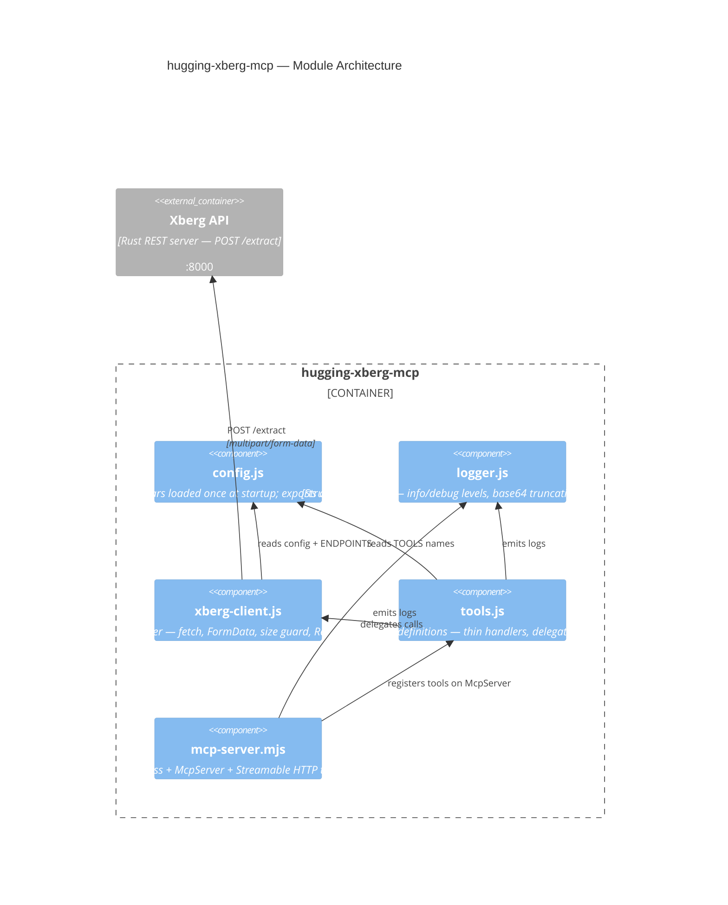

# Component: hugging-xberg-mcp — Module Architecture (src/)

Component-level view of the hugging-xberg-mcp server. The server is split into 5 modules with single responsibilities.

## Diagram



## Elements

| ID | Name | Type | Technology | Description |
|----|------|------|-----------|-------------|
| `config-js` | config.js | Component | Node.js ESM | Single source of truth for all environment variables. Frozen `config` object + `TOOLS` + `ENDPOINTS` |
| `logger-js` | logger.js | Component | Node.js ESM | Two-level structured logging to stderr (stdout reserved for HTTP in Docker) |
| `xberg-client-js` | xberg-client.js | Component | Node.js ESM + fetch | Encapsulates all HTTP calls to Xberg; Result-like `{ ok, body }` / `{ ok, status, error }` returns |
| `tools-js` | tools.js | Component | Node.js ESM + MCP SDK | Thin MCP tool handlers: validate → log → delegate → format |
| `mcp-server-mjs` | mcp-server.mjs | Component | Express + MCP SDK | Server setup: body parser, POST /mcp handler, fresh McpServer per request, graceful shutdown |
| `xberg-api` | Xberg API | Container_Ext | Rust REST server | Extraction engine (`/extract`) |

## Module Details

### config.js — Configuration

Single source of truth for all environment variables. Loaded once at module initialization.

- **Exports:**
  - `config` — frozen configuration object with all env vars (`xbergUrl`, `logLevel`, `mcpPort`, structured-extraction settings)
  - `TOOLS` — constant tool name strings (`EXTRACT_BYTES`, `EXTRACT_STRUCTURED`)
  - `ENDPOINTS` — constant Xberg API endpoint paths (`EXTRACT: '/extract'` only; the old `/extract-structured` endpoint was removed — see ADR-0004)
- Loads `structured-schema.json` from disk at startup (`loadStructuredSchema()`)

### logger.js — Structured Logging

Two-level structured logging to stderr (stdout reserved for HTTP responses in Docker).

- **Exports:** `logInfo(message)`, `logDebug(message)`, `truncateBase64(data, maxLen = 80)`, `maskApiKey(value)`
- **Levels:** `info` — always emitted (startup, tool invocations, Xberg errors); `debug` — only when `LOG_LEVEL=debug` (request bodies, response previews, file sizes)
- **Safety rules:** base64 data always truncated (80 chars + total length); API keys always masked as `present`/`absent`; all logs to stderr via `console.error()`

### xberg-client.js — Xberg API Adapter

Encapsulates all HTTP calls to the Xberg REST API. Returns Result-like objects: `{ ok: true, body }` or `{ ok: false, status, error }`.

- **Exports:**
  - `extractBase64(input)` — strips `data:*/*;base64,` prefix from data URLs; passes raw base64 through unchanged
  - `decodeToBuffer(input)` — extracts base64 and decodes to a Node.js Buffer
  - `extractBytes(args)` — POST `/extract` with multipart form data (`files`, `config`, optional `format`/`output_format`)
  - `buildStructuredConfig()` — builds the `config.structured_extraction` JSON from server-side env vars
  - `extractStructured(data)` — POST `/extract` with `config.structured_extraction` (schema + LLM config from env vars); the old `/extract-structured` endpoint no longer exists (ADR-0004)
- **Data URL support:** both tools accept raw base64 or full data URLs; `extractBase64()` converts transparently
- **Input size limit:** `MAX_BASE64_LENGTH = 48_900_000` chars (~36.5MB raw) — larger payloads rejected with a clear error before any HTTP call (ADR-0003)

### tools.js — MCP Tool Definitions

Thin handlers that validate input (zod), log invocation, delegate to xberg-client, and format the response. Business logic lives in xberg-client.js.

- **Exports:** `registerTools(mcpServer)` — registers both tools on the given McpServer instance
- **Tool signatures:**
  - `extract_bytes({ data, mime_type?, config?, response_format? })`
  - `extract_structured({ data })`
- **`extract_bytes` `response_format` enum:** `['json','toon','plain','markdown','djot','html']` — `'toon'` maps to the multipart `format=toon` field; `'json'` omits the format field (default Xberg JSON envelope); `'plain'|'markdown'|'djot'|'html'` map to `output_format=<value>` content rendering

### mcp-server.mjs — Server Setup

Express application with MCP transport. Creates a fresh `McpServer` per request (stateless mode).

**Lifecycle:**
1. Express app created with JSON body parser (`MCP_BODY_LIMIT`, default 50mb — env-configurable for base64 images/PDFs, ADR-0001)
2. POST /mcp handler creates new McpServer + StreamableHTTPServerTransport per request (`sessionIdGenerator: undefined`)
3. GET/DELETE /mcp return 405
4. Graceful shutdown on SIGINT

**413 handling:** body-parser 413 (payload too large) is preserved as HTTP 413 with JSON-RPC code -32600 and message `Payload too large — request body must be under 50MB`; other errors fall back to 500 with -32603 (ADR-0002).

## Data Flow

### extract_bytes

```
MCP Client                          hugging-xberg-mcp                          Xberg API
    │                                    │                                        │
    │── POST /mcp (tools/call) ─────────▶│                                        │
    │   { name: "extract_bytes",         │                                        │
    │     args: { data, mime_type } }    │                                        │
    │                                    │  tools.js: handleExtractBytes()        │
    │                                    │  → logInfo(invocation)                 │
    │                                    │  → xberg-client.js: extractBytes()     │
    │                                    │     → extractBase64(data)              │
    │                                    │     → decodeToBuffer()                 │
    │                                    │     → FormData + fetch(POST /extract)  │
    │                                    │── POST /extract ──────────────────────▶│
    │                                    │   multipart/form-data                  │
    │                                    │◀───────────────────────────────────────│
    │                                    │   { ok: true, body }                   │
    │                                    │   body: {results, errors?, summary}    │
    │                                    │                                        │
    │◀── SSE response ───────────────────│                                        │
    │   { content: [{type:"text",        │                                        │
    │     text: JSON.stringify(body)}] } │                                        │
```

### extract_structured

Same flow, but:

- Tool only takes `data` (base64 or data URL)
- XbergClient builds a `config` JSON with `structured_extraction` (schema, schema_name, schema_description, prompt, strict, llm{model, base_url, api_key}) from server-side env vars
- POST to `/extract` (the same endpoint as `extract_bytes`) — no separate endpoint (ADR-0004)

## Notes

- **Stateless per request** — fresh `McpServer` + transport per POST /mcp (see [[concepts/0001-mcp-streamable-http-stateless.concept]])
- **Body limit** — 50mb via `MCP_BODY_LIMIT` (see [[adrs/0001-raise-body-limit.adr]])
- **413 preservation** — see [[adrs/0002-preserve-status-codes.adr]]
- **Client guard** — `MAX_BASE64_LENGTH` 48_900_000 (see [[adrs/0003-align-client-guard.adr]])
- **Structured extraction** — config-driven, `/extract` only (see [[adrs/0004-structured-extraction-via-config.adr]])
- Parent container level: [[containers/0001-system-container.container]]
