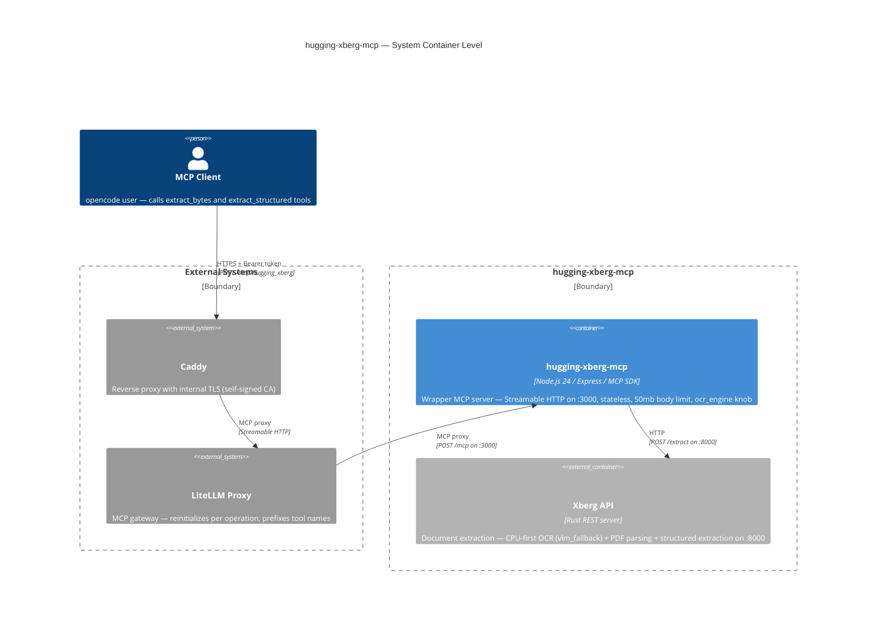

# Container: hugging-xberg-mcp — System

> **Draft note (in-repo):** Rebranded during the `hugging-kreuzberg-mcp` → `hugging-xberg-mcp` port (DEC-0005). Promotion to the durable vault is **pending vault-keeper review** — do not self-promote.

## Diagram

## Elements

| ID | Name | Type | Technology | Description |
|----|------|------|-----------|-------------|
| `client` | MCP Client | Person | — | opencode user calling extract_bytes and extract_structured |
| `caddy` | Caddy | System_Ext | Caddy | Reverse proxy with internal TLS (self-signed CA) |
| `litellm` | LiteLLM Proxy | System_Ext | Python | MCP gateway — reinitializes per operation, prefixes tool names |
| `mcp-server` | hugging-xberg-mcp | Container | Node.js 24 / Express / MCP SDK | Wrapper MCP server — Streamable HTTP on :3000, stateless, 50mb body limit, ocr_engine knob |
| `xberg-api` | Xberg API | Container_Ext | Rust REST server | Document extraction — CPU-first OCR (vlm_fallback) + PDF parsing + structured extraction on :8000 |

## Notes

- **No host port mapping** — mcp-server runs on :3000 inside Docker, NOT exposed to host; only reachable through LiteLLM
- **Stateless transport** — `sessionIdGenerator: undefined`, fresh McpServer per request (see [[concepts/0001-mcp-streamable-http-stateless.concept]])
- **Body limit** — 50mb (env `MCP_BODY_LIMIT`) to accommodate base64 images/PDFs (see [[decisions/0001-raise-body-limit.decision]])
- **Error handling** — Preserves HTTP 413 for payload-too-large (see [[decisions/0002-preserve-status-codes.decision]])
- **Structured extraction** — config-driven via `config.structured_extraction` on `/extract`; no `/extract-structured` (see [[decisions/0004-structured-extraction-via-config.decision]])
- **LiteLLM reinitializes per operation** — every operation calls initialize (see [[memories/0002-litellm-reinit-per-operation.memory]])
- **Tool name prefixing** — LiteLLM prepends `hugging_xberg-` to tool names
- **Port history** — this system was previously `hugging-kreuzberg-mcp` (see [[decisions/0005-port-hugging-kreuzberg-to-xberg.decision]])
- **OCR (2.2.0+)** — CPU-first: Tesseract + PaddleOCR by default with quality-based `vlm_fallback` to VLM; per-request `ocr_engine` knob on the wrapper (see [[decisions/0006-vlm-fallback-native-pipeline.decision]], [[specifications/0002-cpu-first-ocr-vlm-fallback.spec]])
